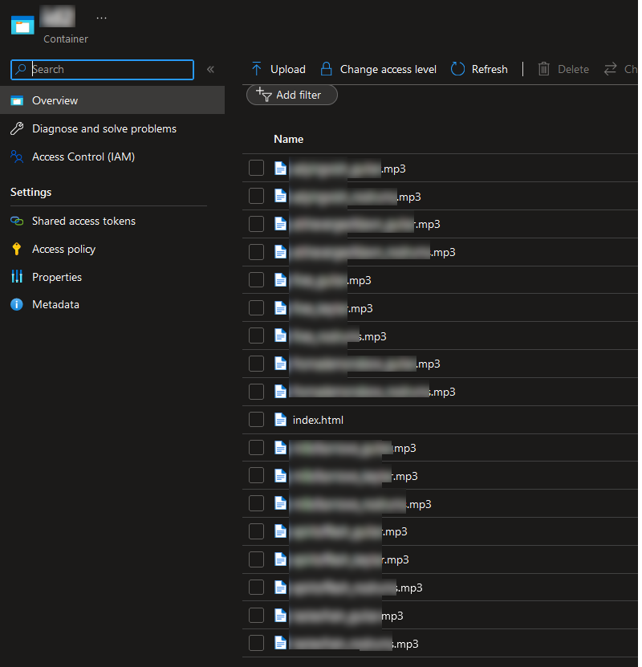
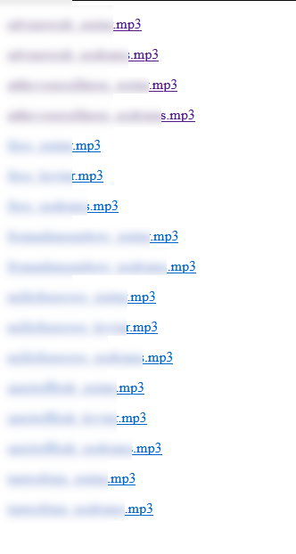

# blobLister

List files on a blob storage.

[Related blog post found here](https://bjompen.com/#/posts/blobLister)

----

Upload this index.html to the same blob container as your files and share this file instead.

Using a container SAS token, browse to the URL

> https://storageaccountname.blob.core.windows.net/containerName/index.html?si=storage&spr=https&sv=2001-01-01&sr=c&sig=l0Ng//c0D3ThatSEEmsT0BeSOM3K1ndOFBaS364=

And the result is this:

